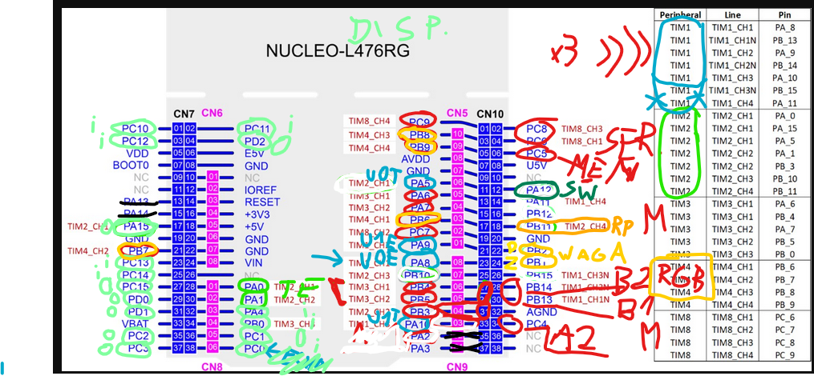
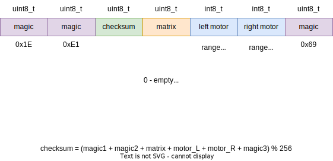

# Rysiek - robot zachęcający do zdrowego żywienia
Repozytorium dla robota ,,Rysiek'', tworzonego w ramach 24-godzinnego hackatonu BITEhack 2024 Kraków 14-15 grudnia 2024 roku. Temat przewodni konkurencji: ,,Zostań bohaterem''.

Skład Zespołu KoNaR_Bravo:

- Michał (Konar) Mastej
- Kamil Winnicki
- Wojciech Bohdan
- Eryk Możdżeń

### ESP32-CAM firmware
https://github.com/ESP32Tutorials/ESP32-CAM-ESP-IDF-Live-Streaming-Web-Server?tab=readme-ov-file

### Hardware

### Protocols

